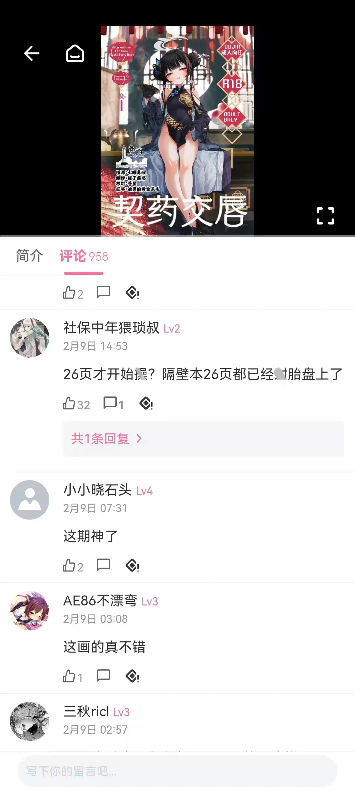
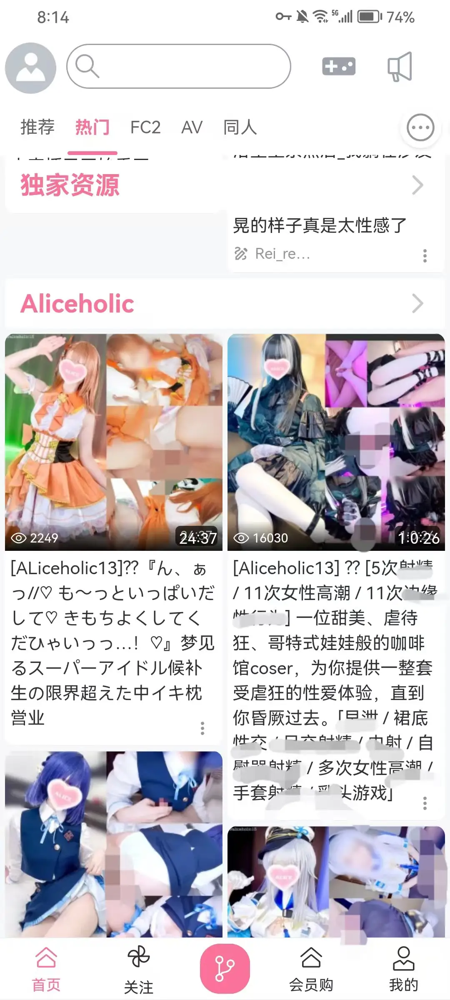

<p align="center">
    
</p>

```python
_____   _________________ ____        __________________ _____   ______
|  __ \|  ____|| |__   __| __ \      / ______\   |  \/  |_   _| / _____\
| |  | | |__   | |  | |  | | \ \    | |    _____ | \  / | | |  | /
| |  | |  __|  | |  | |  | |__\ \   | |   /  _  \| |\/| | | |  | |
| |__| | |____ | |__| |  |  ___\ \  | |___| |_| || |  | |_| |_ | \_____
|_____/|______||______|  |_|    \_\  \__________/|_|  \_______| \______/
=========================================================================
  Per Aspera, Ad Astra.                              Copyright © Wenxig
```

<p align="center">
    <a href="https://github.com/semantic-release/semantic-release">
      
    </a>
    <a href="https://github.com/delta-comic/delta-comic/blob/main/LICENSE">
      
    </a>
    <a href="https://github.com/delta-comic/delta-comic/releases/latest">
      
    </a>
    <a href="https://wakatime.com/projects/delta-comic">
      
    </a>
</p>

---

## 为什么选择 Delta Comic

- **多源合一**：通过插件把多个站点的内容统一呈现，无需在各站点间切换。
- **用户优先**：界面与阅读体验为中心，支持主题切换、夜间模式等常见阅读习惯。
- **人性化UI**：仿**BiliBili**的移动端界面，经过市场验证，使用更舒心。
- **开源与可扩展**：插件模式让更多站点能快速接入（对普通用户透明）。

> 声明：本项目主要用于技术研究与自用，尊重内容原作者与平台规则，下载后请于24小时内删除；使用时请遵守相关法律法规与站点条款。

> 项目底层再次重构中...

[**评论区戳我**](https://github.com/orgs/delta-comic/discussions/32)

## 实机演示

| [](https://github.com/delta-comic/delta-comic/releases/latest) | [](https://github.com/delta-comic/delta-comic/releases/latest) | [](https://github.com/delta-comic/delta-comic/releases/latest) |
| :-: | :-: | :-: |

| [](https://github.com/delta-comic/delta-comic/releases/latest) | [](https://github.com/delta-comic/delta-comic/releases/latest) | [](https://github.com/delta-comic/delta-comic/releases/latest) |
| :-: | :-: | :-: |

## 如何使用

### Android

1. 安装应用
2. 在下文所提及的插件中选择一些安装
3. 启动！

### 插件集合

[](https://github.com/delta-comic/awesome-plugins) 

## 工程路线图

> 代码块内是下载命令
- [x] 哔咔漫画 `ap:bika` -_何以忘却_
- [x] 禁漫天堂 `ap:jmcomic` -_何以哀怮_
- [x] CosAv `ap:cosav` -_何以殁亡_
- [ ] E-Hentai -_何以战栗_
- [ ] Hanime1 _何以倾慕_
- _待定_ -_无以迷惘_
- _待定_ -_无以踟蹰_
- _待定_ -_无以迁怒_
- _待定_ -_无以夸矜_
- _待定_ -_无以降神_

## 想要编写插件?

[](https://github.com/delta-comic/delta-comic-core)  
 该包可为你提供许多基本的数据结构, 与便捷的`definePlugin`

## Star History

[](https://www.star-history.com/#delta-comic/delta-comic&Date)

## 状态


